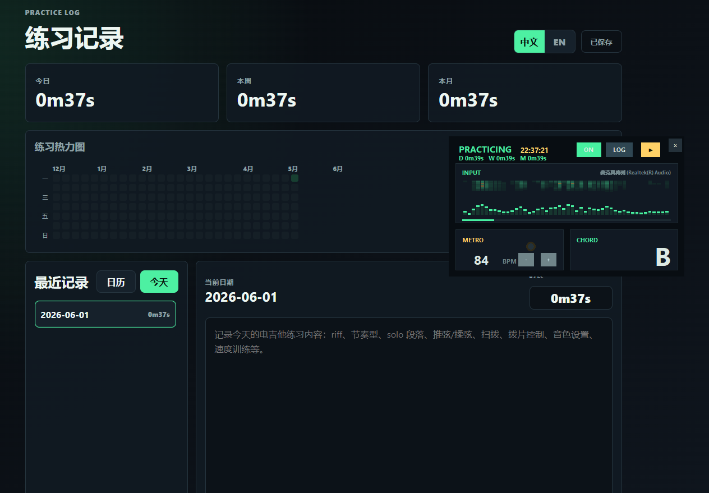

# Guitar Practice Monitor

[English](README.en.md)

Guitar Practice Monitor 是一个轻量的桌面吉他练习记录器，支持 Windows 和 macOS。

它把桌面浮窗和本地练习记录结合起来，让日常练琴没那么枯燥：

- 实时输入可视化
- 实时和弦显示
- 简单节拍器
- 选择输入设备后自动记录练习时长
- 本地 Web 面板查看每日、每周、每月记录
- 记录 riff、节奏型、solo 段落、技巧练习、音色设置、速度训练等内容

所有数据都保存在本地。

## 截图



## 下载

在 GitHub Releases 下载最新版构建：

```text
Windows → guitar-practice-monitor-windows.zip
macOS M-series arm64 → guitar-practice-monitor-macos-arm64.zip
```

Windows 构建产物是一个可直接运行的文件夹：

```text
GuitarPracticeMonitor/
  guitar-practice-monitor.exe
  data/
    practice_log.json
```

macOS 构建产物包含应用、本地数据目录和调试启动脚本：

```text
GuitarPracticeMonitor-macos-arm64/
  Guitar Practice Monitor.app
  Launch Debug.command
  data/
    practice_log.json
```

macOS 构建目前未签名。如果首次打开被系统拦截：

1. 打开系统设置，进入隐私与安全性。
2. 在安全性区域点击仍要打开。
3. 如果仍然打不开，可以在终端执行：

```bash
xattr -dr com.apple.quarantine ~/Downloads/GuitarPracticeMonitor-macos-arm64
```

如果应用打开后立刻退出，崩溃日志会写到：

```text
GuitarPracticeMonitor-macos-arm64/data/crash.log
```

如果没有 `crash.log`，说明可能还没跑到 Python 主程序。可以双击 `Launch Debug.command`，再查看：

```text
GuitarPracticeMonitor-macos-arm64/data/terminal.log
```

## 使用

- 点击 `MIC` 选择输入设备。选择成功后状态会从 `WAITING` 变成 `PRACTICING`，并开始自动计时。
- 点击 `LOG` 打开练习记录页面，可查看每日、每周、每月统计，也可以编辑每天的练习内容。
- 点击节拍器按钮开启或关闭节拍器，直接输入速度数值可调整 BPM。
- 关闭浮窗时，本次练习时长会保存到当天记录。

## 数据

练习记录保存在程序文件夹内：

```text
data/practice_log.json
```
